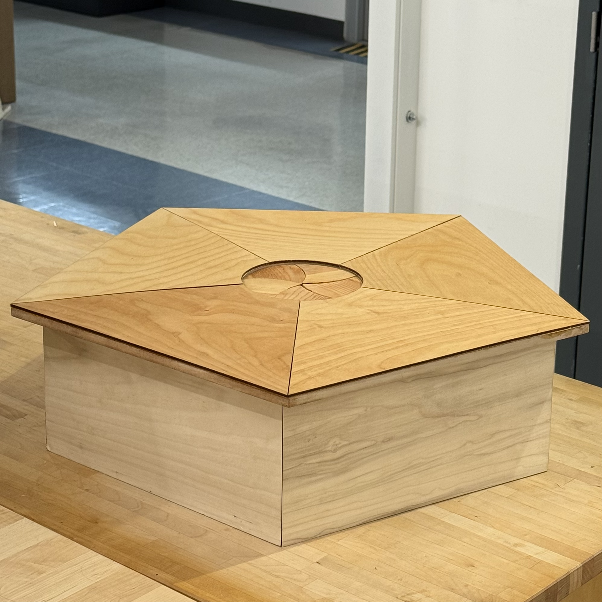

 
  In Spring 2026, I was a part of the [E177: Mechanical Design](https://catalog.hmc.edu/preview_course_nopop.php?catoid=26&coid=8532), a project-based 
  upper-division engineering course at Harvey Mudd College focused on the design, analysis, and fabrication of mechanical systems. The course emphasizes 
  iterative design, precision manufacturing, and working within real-world constraints.

###  The Iris Box ### 

 
  For the six-week culminating project, my team designed and built a five-petal mechanical [Iris Box](https://sites.google.com/g.hmc.edu/iris-box/home) 
  that opens to reveal a hidden bowl 
  when the tabletop is rotated. The goal was to create a manually actuated mechanism that was both mechanically intricate and visually 
  satisfying as a piece of functional decor. While inspired by a concept seen online, all components were independently designed and 
  fabricated by our team.

 
  To increase the complexity of the project, we implemented a five-sided enclosure to match the iris geometry. This introduced unique 
  fabrication and assembly challenges, as traditional clamping methods relying on parallel faces were not possible. Internally, arranging 
  components in a five-fold symmetric layout required careful planning to maintain balance while avoiding interference between parts. Material 
  choices and overall system dimensions were also carefully selected to stay within a $350 budget without sacrificing performance
  or aesthetics.

 
    To learn more about the project, click the links below to access the full project website and demo video!

  <a href="https://youtube.com/shorts/TG9Nzdz7vSc?si=r9jVqXtssI37773S" target="_blank">
    <button style="border-radius: 6px; padding: 8px 14px; background-color: #ff0000; color: white; border: none; font-weight: bold; cursor: pointer;">
      ▶ Iris Box Demo Video
    </button>
  </a>

  <a href="https://sites.google.com/g.hmc.edu/iris-box/home" target="_blank">
    <button style="border-radius: 6px; padding: 8px 14px; background-color: #277ecf; color: white; border: none; font-weight: bold; cursor: pointer;">
      Full Project Website
    </button>
  </a>

  <a href="documents/exploded_views.pdf" target="_blank">
    <button style="border-radius: 6px; padding: 8px 14px; background-color: #d1ca0a; color: white; border: none; font-weight: bold; cursor: pointer;">
      Technical Drawings
    </button>
  </a>
 

