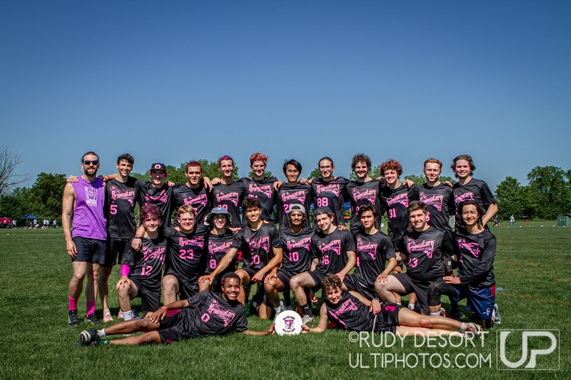
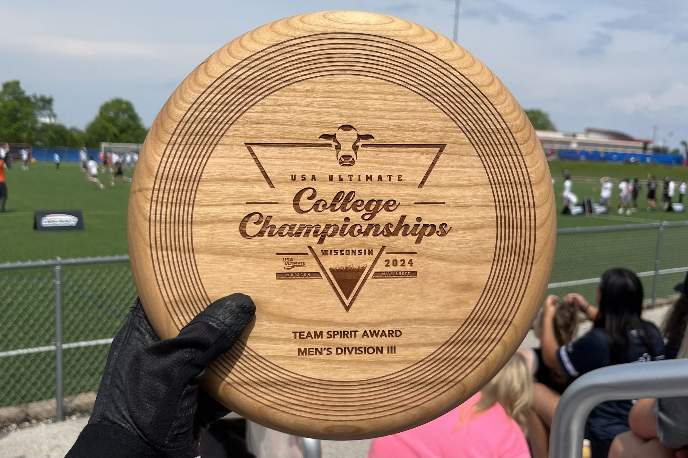
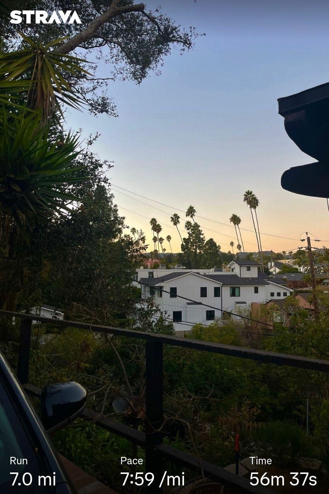
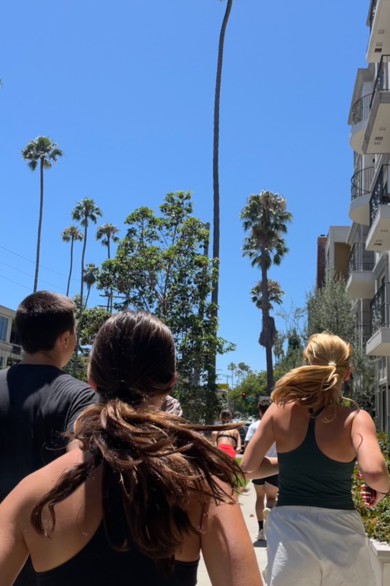
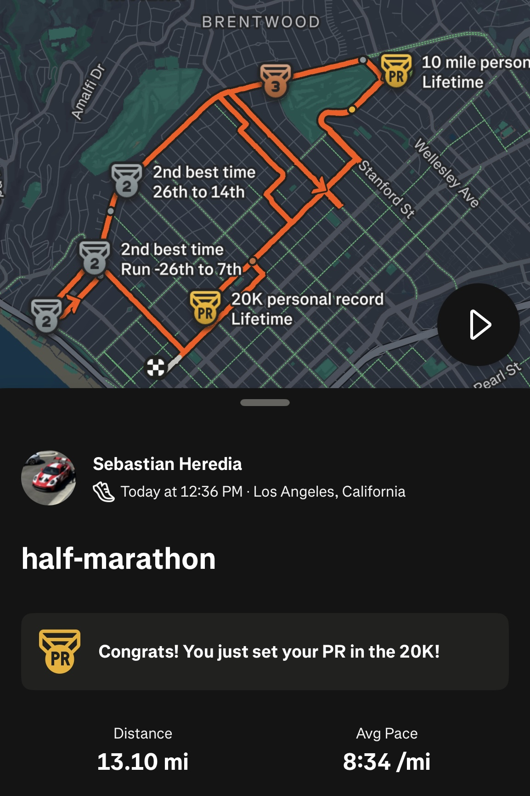
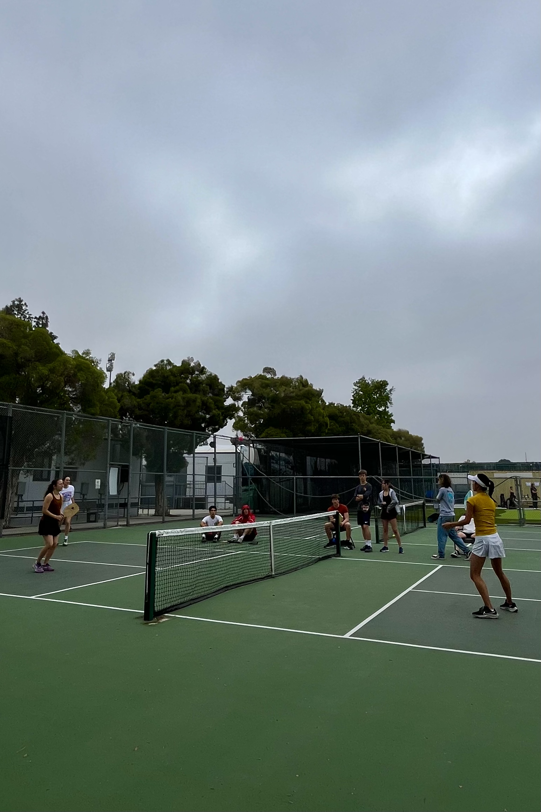

## Ultimate Frisbee ##

 
  The [Claremont Braineaters](https://linktr.ee/brainsult) are a group of frisbee enthusiasts from all over the Claremont Colleges. 
  We are an inclusive, gender expansive team and hold trainings three times a week for 2-hours to practice gameplay, strategy, 
  and have a good time. We represented the South West region at the 2024 and 2025 USAU Men's Division-III Nationals, earning the 
  Team Spirit Award for outstanding knownledge of the game and sportsmanship in 2024. I've made countless memories with the 
  team both on and off field, and I'm excited to see where we go this season.

  
  

  

    *Braineaters at 2024 D-III Nationals in Milwaukee, WI*
  

  
  

  

    *Recipients of the 2024 Men's D-III Spirit Award*
  

## Running ##

 
 Growing up playing soccer throughout high school, transitioning into recreational running in college felt like a natural next step. 
 I began my running journey in Summer 2024, starting with 5K and 10K runs alongside my dad. Since then, I’ve built consistency and 
 endurance by setting personal challenges—most notably running 100 miles over 4 weeks during both of my past winter breaks (averaging 
 about 3 miles per day). In Summer 2025, I completed my first half marathon at an 8:34 pace, and I’m currently working toward running a full marathon.
 Outside of running, I like to mix in jump rope, stair climbing, yoga, and weight training to stay well-rounded and prevent injury. Feel free to connect with me o [Strava](https://strava.app.link/4ifxnmrPQUb)!

  

  
  

  

    *Run at sunset in Los Angeles, CA*
  

  

  

  
  

  

    *Neighborhood run club with friends*
  

  

  

  
  

  

    *Half marathon in Santa Monica, CA*
  

  

## Pickleball ##

 
  On weekends, my friends and I play pickleball at the [Robert's Pavillion](https://roberts-pavilion.cmc.edu/) at Claremont McKenna College. 
  We play singles, doubles, and king of the court style play. It's always a good time and our play sessions last anywhere from 2-4 hours each.

  

  
  

  

    *Weekend pickleball with friends*
  

  

  

  
  

  

    *Machine Shop proctor tournament*
  

  

  

  
  

  

    *Pickleball in Westchester, CA*
  

  

